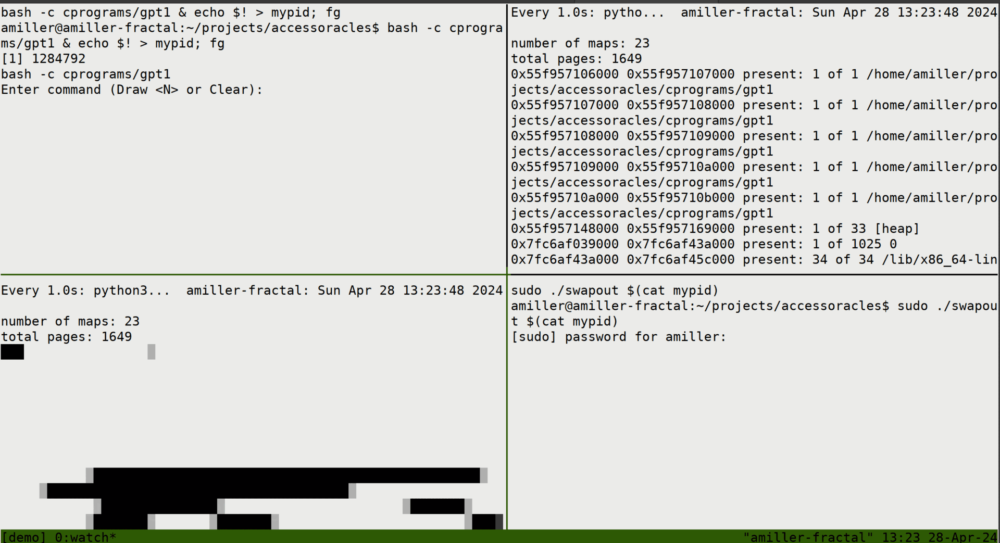

# Illustration of Memory Access Pattern monitoring in Linux

The idea is we will create a victim process, then use some linux tools to
monitor its memory access patterns and influence its page tables.

The two main tools on display here are the `/proc/{pid}/pagemap` pseudofile,
and the `process_madvise` syscall.

The `pagemap` and `maps` are metadata about running processes, and we can use them
to see which pages have been accessed by the victim process. https://man7.org/linux/man-pages/man5/proc.5.html

The `process_madvise` syscall allows one process to influence the memory handling of another. 
https://man7.org/linux/man-pages/man2/process_madvise.2.html


## Parsing the pagemaps

The pagemaps.py is a very simple python script used to illustrate how we can
inspect the pagetables of a running process.

First it parses the listings from `/proc/{pid}/maps` which is human readable,
and has one line for each range. It indicates which are backed by files, which
are for the stack and the heap, and which are anonymous or occupy static
areas of the program.

Next it traverses the more detailed `/proc/{pid}/pagemap` structure to read more of the page table entries. This indicates whether a given page is
"present", meaning backed by physical memory, or "non-present" meaning swapped out

For a reference, look here:
https://www.kernel.org/doc/Documentation/vm/pagemap.txt

## Unpaging the pagemaps

The swapout tool (./swapout.c) iterates through the pagemaps, and uses the `process_madvise` syscall to unpage the memory. This is present in Linux 5.10 and on.

This code comes from this Stack Overflow answer: https://serverfault.com/questions/938431/is-there-a-way-to-force-a-single-process-to-swap-most-all-of-its-memory-to-disk

## Run a demo in Tmux

The makefile builds both the victim program (cprograms/gpt1) and the swapout tool.

You can run the demo in multiple terminal windows, or follow the entire demo packed into a single tmux script:
```bash
   sh tmuxdemo.sh
```

This does the following:
- Runs the victim program, storing the PID in `mypid`. Type `Draw 12` (or a number of your choice) to access pages in an input-dependent pattern.
- Displays the histogram of which pages are present (on repeat)
- Displays a text render of the pagemap ranges (on repeat)
- (With sudo) Swap out all the pages of the victim using madvise.

By alternating `Draw <N>` command and `sudo ./swapout $(cat mypid)`, you can access the memory in an input dependent pattern, and then force all the memory to be swapped out.



## What about SGX?

If we run a gramine process instead of plain linux process, we will see the pagemaps look a little different:
```
Number of maps: 53                                                                            
total pages: 6415                                                                             
0x10000 0xe3b000 present: 0 of 3627 /dev/sgx_enclave                                          
0xe3b000 0xe8b000 present: 0 of 80 /dev/sgx_enclave                                            
0xe8b000 0xe90000 present: 0 of 5 /dev/sgx_enclave
...
```
We can see the pages are mapped through the `/dev/sgx_enclave` device driver, rather than through the ordinary mapping.
It turns out it's still possible to spy on the page tables from within the kernel, but it requires a different path than what's exposed through the `/proc` filesystem.

See the repository for the "Stealthy Page Table-Based Attacks" paper, which works by defining a kernel module to observe the page tables:
https://github.com/jovanbulck/sgx-pte
